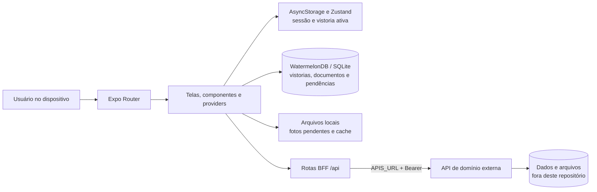

# Peacore Vistorias Mobile

Aplicativo Android e iOS para consultar vistorias, registrar a conclusão com foto e localização e acessar documentos técnicos. A aplicação é construída com Expo e mantém uma cópia local dos dados para sustentar o fluxo de conclusão quando a conexão não estiver disponível.

> Este repositório contém o cliente mobile em Expo/React Native, sua persistência SQLite local e as rotas de integração do Expo Router. A API de domínio, a persistência remota, o armazenamento de arquivos, o protocolo completo de conflitos e a infraestrutura de implantação não fazem parte do código versionado aqui. Essa separação deixa claros os limites da implementação atual.

## Sumário

- [Visão geral](#visão-geral)
- [Estado atual e cobertura funcional](#estado-atual-e-cobertura-funcional)
- [Arquitetura](#arquitetura)
- [Tecnologias](#tecnologias)
- [Pré-requisitos e configuração](#pré-requisitos-e-configuração)
- [Execução e verificações](#execução-e-verificações)
- [Rotas e fluxos disponíveis](#rotas-e-fluxos-disponíveis)
- [Decisões técnicas](#decisões-técnicas)
- [Segurança e limites conhecidos](#segurança-e-limites-conhecidos)
- [Próximos incrementos de maior impacto](#próximos-incrementos-de-maior-impacto)
- [Documentação complementar](#documentação-complementar)

## Visão geral

O aplicativo concentra os fluxos de autenticação, consulta de vistorias pendentes, seleção de atendimento, captura de foto, obtenção de localização, conclusão online ou offline e acesso a documentos técnicos. As telas são organizadas pelo Expo Router. A área autenticada mantém um `ProvedorConexao`, que observa a conectividade e solicita a sincronização dos dados locais quando a rede é restabelecida.

As leituras de vistorias e documentos vêm do WatermelonDB/SQLite local. As rotas `+api.ts` do Expo Router atuam como um Backend for Frontend (BFF) leve: recebem o token do aplicativo, encaminham a chamada para a API indicada por `APIS_URL` e devolvem a resposta. Em produção nativa, essas rotas exigem que o servidor Expo esteja implantado e configurado como origem do aplicativo.

## Estado atual e cobertura funcional

| Funcionalidade | Situação neste repositório | Observação |
| --- | --- | --- |
| Login e persistência de sessão | Parcial | Há formulário de login e token em `AsyncStorage`; ainda não há armazenamento seguro nem proteção de rotas antes da renderização. |
| Consulta de vistorias | Disponível | A tela observa no banco local as vistorias marcadas como pendentes. |
| Seleção de vistoria | Disponível | A vistoria ativa é persistida com Zustand e `AsyncStorage`. |
| Captura e conclusão com foto/localização | Disponível | Solicita permissões, captura imagem, registra coordenadas e envia a conclusão por multipart quando online. |
| Fila de conclusão offline | Parcial | Foto e metadados são persistidos localmente e reenviados ao recuperar a rede; não há identificador idempotente nem resolução de conflitos. |
| Sincronização de vistorias e documentos | Parcial | Atualiza listas locais ao entrar em estado online; não há cursor incremental, versões ou retentativa persistente. |
| Abertura de documentos | Disponível online | Faz download sob demanda e abre pelo sistema operacional; não há catálogo de documentos disponível offline. |
| Backend compartilhado e armazenamento remoto | Externos ao repositório | Dependem de uma API configurada em `APIS_URL`. |
| Implantação do servidor Expo e CI | Não incluídos | Não há configuração versionada de hosting para as API Routes, Docker ou pipeline de integração contínua. |

## Arquitetura



A sincronização atual envia primeiro as conclusões pendentes, remove a pendência somente após a resposta bem-sucedida e então atualiza as listas locais de vistorias e documentos. O detalhamento de responsabilidades, dados locais, limitações e evolução recomendada está em [docs/ARQUITETURA.md](docs/ARQUITETURA.md).

## Tecnologias

| Camada | Tecnologia | Uso atual |
| --- | --- | --- |
| Aplicativo | Expo SDK 57, React Native 0.86, React 19 e TypeScript | Execução em Android/iOS, telas e rotas com Expo Router. |
| Interface | NativeWind e componentes locais baseados em Gluestack UI | Tokens visuais e primitivas reutilizáveis de layout, texto, entrada e interação. |
| Persistência local | WatermelonDB com adaptador SQLite | Espelha documentos e vistorias, além da fila de conclusões pendentes. |
| Estado persistido | Zustand e AsyncStorage | Mantém a vistoria ativa; o token de sessão também é armazenado no AsyncStorage. |
| Recursos nativos | Expo Location, Image Picker, File System, Sharing e Intent Launcher | Permissões, foto, localização, arquivos e abertura de documentos. |
| Conectividade | Expo Network e `fetch` | Detecta disponibilidade de rede e integra o app às rotas do Expo e à API de domínio. |
| Mapa | `react-native-leaflet-view` | Exibe a posição atual quando há coordenadas disponíveis. |

## Pré-requisitos e configuração

- Node.js LTS compatível com o Expo SDK 57.
- npm.
- Android Studio e um emulador Android, ou Xcode e um simulador/dispositivo iOS, para execução nativa.
- Uma API de domínio acessível pelos endpoints usados pelas rotas em `src/app/api/`.

Instale as dependências e crie o ambiente local:

```bash
npm install
```

Crie `.env.local` com a URL base da API, sem barra ao final:

```dotenv
APIS_URL=https://api.exemplo.com
```

`APIS_URL` é lida pelas API Routes do Expo Router. Para builds nativos de produção, implante essas rotas em um servidor compatível e configure a origem do `expo-router`; os `fetch` relativos, como `/api/vistorias/verVistorias`, dependem dessa origem fora do ambiente de desenvolvimento.

## Execução e verificações

```bash
npm run start
```

Use as opções exibidas pelo Expo CLI para iniciar no emulador, simulador ou development build. Os comandos disponíveis são:

```bash
npm run android
npm run ios
npm run lint
npm run build:android:local
npm run build:ios:local
```

O repositório ainda não possui testes automatizados. Antes de uma entrega, valide manualmente login, sincronização inicial, seleção de vistoria, permissões de câmera e localização, conclusão online, conclusão offline seguida de retomada de rede e abertura de documentos em cada plataforma suportada.

No estado atual, `tsc --noEmit` também percorre o material de referência em `Design/GlueStackUI Pro`, que possui dependências e erros próprios. Esse resultado não representa apenas o código mantido do aplicativo.

## Rotas e fluxos disponíveis

| Rota de interface | Finalidade |
| --- | --- |
| `/` | Login; armazena o `accessToken` devolvido pela API no armazenamento local. |
| `/home` | Exibe relógio, conexão, mapa, vistoria ativa e inicia a captura para conclusão. |
| `/vistorias` | Lista as vistorias locais pendentes e permite selecionar a vistoria ativa. |
| `/documentos` | Lista metadados locais de documentos e baixa/abre o arquivo autenticado sob demanda. |

| Rota de integração | Método | Finalidade |
| --- | --- | --- |
| `/api/auth/login` | `POST` | Encaminha autenticação para a API de domínio. |
| `/api/vistorias/verVistorias` | `GET` | Recupera vistorias com o cabeçalho `Authorization`. |
| `/api/vistorias/concluirVistoria` | `PUT` | Encaminha foto, coordenadas e conclusão no formato multipart. |
| `/api/documentos/recuperarDocumentos` | `GET` | Recupera os metadados dos documentos. |
| `/api/documentos/:id/arquivo` | `GET` | Transfere o arquivo autenticado do documento. |

Os detalhes de implementação das API Routes estão em [docs/API_REQUESTS.md](docs/API_REQUESTS.md).

## Decisões técnicas

- **Expo Router para organizar interface e integração.** Rotas de tela e handlers `+api.ts` permanecem no mesmo módulo de aplicação, tornando explícita a separação entre código de cliente e código de servidor.
- **WatermelonDB como cópia de trabalho local.** As listas não dependem de uma chamada remota por tela, e as operações locais de sincronização usam transações e lotes.
- **Fila local para conclusões offline.** Antes de aguardar rede, a foto é copiada para armazenamento persistente e a pendência fica registrada no banco local.
- **Sincronização centralizada pela conectividade.** O `ProvedorConexao` evita sincronizações concorrentes em memória e tenta atualizar os dados ao transicionar para online.
- **Multipart binário construído no cliente.** A foto é enviada como `Uint8Array`, preservando o formato esperado pela rota de conclusão sem depender de `FormData` nativo para esse fluxo.
- **Componentes por responsabilidade de interface.** Listas, modais, indicadores, navegação e primitivas visuais ficam em `src/components/`; telas coordenam estado e ações do fluxo.

## Segurança e limites conhecidos

O projeto implementa um fluxo funcional de campo, mas ainda não representa uma solução completa de segurança e sincronização. Antes de publicação, considere:

- O `AsyncStorage` não é o armazenamento recomendado para tokens sensíveis. Use armazenamento seguro do sistema e implemente expiração, renovação e saída da sessão.
- As telas autenticadas não validam uma sessão antes da renderização. A API de domínio deve continuar validando toda autorização por recurso.
- As API Routes dependem de implantação de servidor e origem configurada para funcionar em builds nativos de produção; o `app.json` atual ainda não define essa origem.
- A fila não possui `operationId`, versão remota, cursor ou resolução de conflito. Uma confirmação perdida após o envio depende da idempotência da API externa para não duplicar efeitos.
- Os documentos são baixados sob demanda; não há checksum, versionamento nem garantia de disponibilidade offline.
- Fotos e coordenadas podem ser dados pessoais. Não devem aparecer em logs e precisam de políticas de retenção, acesso e exclusão na API de domínio.

## Próximos incrementos de maior impacto

O caminho mais consistente é implantar o servidor das API Routes, configurar sua origem segura nos builds nativos e evoluir a API de domínio para uma sincronização idempotente com cursor, versões e conflitos explícitos. Em seguida, o aplicativo deve registrar `operationId` e versão por entidade, persistir erros e retentativas da fila, e disponibilizar documentos offline com checksum e versionamento.

Na camada de cliente, os ganhos imediatos são mover o token para armazenamento seguro, proteger a área autenticada, comunicar estados persistentes de sincronização e cobrir os fluxos críticos com testes de unidade, integração e interrupção real de rede. A estratégia detalhada está em [docs/ARQUITETURA.md](docs/ARQUITETURA.md).

## Documentação complementar

- [Arquitetura, persistência local e estratégia offline-first](docs/ARQUITETURA.md)
- [Referência das API Routes do Expo Router](docs/API_REQUESTS.md)
- [Orientações para LLMs e design](docs/LLMs/)
