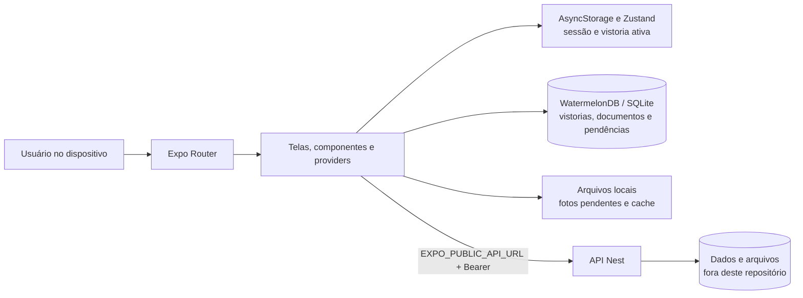

# Peacore Vistorias Mobile

Aplicativo Android e iOS para consultar vistorias, registrar a conclusão com foto e localização e acessar documentos técnicos. A aplicação é construída com Expo e mantém uma cópia local dos dados para sustentar o fluxo de conclusão quando a conexão não estiver disponível.

> Este repositório contém o cliente mobile em Expo/React Native e sua persistência SQLite local. O aplicativo acessa diretamente a API de domínio do monorepo; a persistência remota permanece sob responsabilidade dessa API.

## Sumário

- [Visão geral](#visão-geral)
- [Estado atual e cobertura funcional](#estado-atual-e-cobertura-funcional)
- [Arquitetura](#arquitetura)
- [Tecnologias](#tecnologias)
- [Pré-requisitos e configuração](#pré-requisitos-e-configuração)
- [Execução e verificações](#execução-e-verificações)
- [Rotas e fluxos disponíveis](#rotas-e-fluxos-disponíveis)
- [Decisões técnicas](#decisões-técnicas)
- [Segurança e limites conhecidos](#segurança-e-limites-conhecidos)
- [Próximos incrementos de maior impacto](#próximos-incrementos-de-maior-impacto)
- [Documentação complementar](#documentação-complementar)

## Visão geral

O aplicativo concentra os fluxos de autenticação, consulta de vistorias pendentes, seleção de atendimento, captura de foto, obtenção de localização, conclusão online ou offline e acesso a documentos técnicos. As telas são organizadas pelo Expo Router. A área autenticada mantém um `ProvedorConexao`, que observa a conectividade e solicita a sincronização dos dados locais quando a rede é restabelecida.

As leituras de vistorias e documentos vêm do WatermelonDB/SQLite local. Quando há rede, o aplicativo chama diretamente a API Nest configurada em `EXPO_PUBLIC_API_URL`, encaminhando o token Bearer nas rotas protegidas. Não há servidor Expo nem versão web do Expo nesta arquitetura.

## Estado atual e cobertura funcional

| Funcionalidade | Situação neste repositório | Observação |
| --- | --- | --- |
| Login e persistência de sessão | Parcial | Há formulário de login e token em `AsyncStorage`; ainda não há armazenamento seguro nem proteção de rotas antes da renderização. |
| Consulta de vistorias | Disponível | A tela observa no banco local as vistorias marcadas como pendentes. |
| Seleção de vistoria | Disponível | A vistoria ativa é persistida com Zustand e `AsyncStorage`. |
| Captura e conclusão com foto/localização | Disponível | Captura `completedAt` no clique, antes da localização, e envia a conclusão por multipart quando online. |
| Fila de conclusão offline | Disponível | Foto, metadados e a mesma `completedAt` são persistidos e reenviados ao recuperar a rede; um `409` descarta a pendência perdedora e atualiza os dados vencedores. |
| Sincronização de vistorias e documentos | Parcial | Atualiza listas locais ao entrar em estado online; não há cursor incremental, versões ou retentativa persistente. |
| Abertura de documentos | Disponível online | Faz download sob demanda e abre pelo sistema operacional; não há catálogo de documentos disponível offline. |
| Backend compartilhado e armazenamento remoto | `vistoria-back/` | São acessados diretamente pela URL pública configurada no aplicativo. |

## Arquitetura



A sincronização envia primeiro as conclusões pendentes. A API escolhe a menor `completedAt`; em um conflito `409 INSPECTION_COMPLETION_CONFLICT`, a pendência e a foto perdedoras são removidas, a sincronização continua e o aplicativo comunica o resultado. Depois, as listas locais de vistorias e documentos são atualizadas.

## Tecnologias

| Camada | Tecnologia | Uso atual |
| --- | --- | --- |
| Aplicativo | Expo SDK 57, React Native 0.86, React 19 e TypeScript | Execução em Android/iOS, telas e rotas com Expo Router. |
| Interface | NativeWind e componentes locais baseados em Gluestack UI | Tokens visuais e primitivas reutilizáveis de layout, texto, entrada e interação. |
| Persistência local | WatermelonDB com adaptador SQLite | Espelha documentos e vistorias, além da fila de conclusões pendentes. |
| Estado persistido | Zustand e AsyncStorage | Mantém a vistoria ativa; o token de sessão também é armazenado no AsyncStorage. |
| Recursos nativos | Expo Location, Image Picker, File System, Sharing e Intent Launcher | Permissões, foto, localização, arquivos e abertura de documentos. |
| Conectividade | Expo Network e `fetch` | Detecta disponibilidade de rede e integra o app diretamente à API Nest. |
| Mapa | `react-native-leaflet-view` | Exibe a posição atual quando há coordenadas disponíveis. |

## Pré-requisitos e configuração

- Node.js LTS compatível com o Expo SDK 57.
- npm.
- Android Studio e um emulador Android, ou Xcode e um simulador/dispositivo iOS, para execução nativa.
- A API Nest acessível pelo emulador, dispositivo ou ambiente de produção.

Instale as dependências e crie o ambiente local:

```bash
npm install
```

Crie `.env.local` com a URL base da API, sem barra ao final:

```dotenv
EXPO_PUBLIC_API_URL=http://10.0.2.2:3001
```

`EXPO_PUBLIC_API_URL` é incorporada ao bundle e não pode conter credenciais, tokens ou outros segredos. Não acrescente barra ao final. Para emulador Android, use `http://10.0.2.2:3001`; em aparelho físico, use o IP LAN do computador; em produção, use uma URL HTTPS pública da API. Consulte também [`.env.example`](.env.example).

## Execução e verificações

```bash
npm run start
```

Use as opções exibidas pelo Expo CLI para iniciar no emulador, simulador ou development build. Os comandos disponíveis são:

```bash
npm run android
npm run ios
npm run lint
npm run build:android:local
npm run build:ios:local
```

O repositório ainda não possui testes automatizados. Antes de uma entrega, valide manualmente login, sincronização inicial, seleção de vistoria, permissões de câmera e localização, conclusão online, conclusão offline seguida de retomada de rede e abertura de documentos em cada plataforma suportada.

No estado atual, `tsc --noEmit` também percorre o material de referência em `Design/GlueStackUI Pro`, que possui dependências e erros próprios. Esse resultado não representa apenas o código mantido do aplicativo.

## Rotas e fluxos disponíveis

| Rota de interface | Finalidade |
| --- | --- |
| `/` | Login; armazena o `accessToken` devolvido pela API no armazenamento local. |
| `/home` | Exibe relógio, conexão, mapa, vistoria ativa e inicia a captura para conclusão. |
| `/vistorias` | Lista as vistorias locais pendentes e permite selecionar a vistoria ativa. |
| `/documentos` | Lista metadados locais de documentos e baixa/abre o arquivo autenticado sob demanda. |

| Rota da API Nest | Método | Finalidade |
| --- | --- | --- |
| `/usuarios/login` | `POST` | Autentica o técnico com `email` e `password`. |
| `/vistorias` | `GET` | Recupera vistorias com o cabeçalho `Authorization`. |
| `/vistorias/:id` | `PUT` | Recebe foto, coordenadas, `completedAt` e `pendente=false` no formato multipart. |
| `/documentos` | `GET` | Recupera os metadados dos documentos. |
| `/documentos/:id/arquivo` | `GET` | Transfere o arquivo autenticado do documento. |

## Decisões técnicas

- **Expo Router para organizar a interface nativa.** O aplicativo contém apenas rotas de tela; cada fluxo chama diretamente a rota correspondente da API Nest usando `EXPO_PUBLIC_API_URL`.
- **WatermelonDB como cópia de trabalho local.** As listas não dependem de uma chamada remota por tela, e as operações locais de sincronização usam transações e lotes.
- **Precedência pela primeira marcação.** A data `completedAt` é capturada antes de obter a localização, persiste na fila e é comparada atomicamente pela API; a conclusão é terminal.
- **Fila local para conclusões offline.** Antes de aguardar rede, a foto é copiada para armazenamento persistente e a pendência, incluindo `completedAt`, fica registrada no banco local.
- **Sincronização centralizada pela conectividade.** O `ProvedorConexao` evita sincronizações concorrentes em memória e tenta atualizar os dados ao transicionar para online.
- **Atualização ao acessar telas.** Com conexão ativa informada pelo `expo-network`, Vistorias consulta `GET /vistorias` e Documentos consulta `GET /documentos` ao receber foco; cada resposta atualiza somente a tabela local correspondente.
- **Multipart binário construído no cliente.** A foto é enviada como `Uint8Array`, preservando o formato esperado pela rota de conclusão sem depender de `FormData` nativo para esse fluxo.
- **Componentes por responsabilidade de interface.** Listas, modais, indicadores, navegação e primitivas visuais ficam em `src/components/`; telas coordenam estado e ações do fluxo.

## Segurança e limites conhecidos

O projeto implementa um fluxo funcional de campo, mas ainda não representa uma solução completa de segurança e sincronização. Antes de publicação, considere:

- O `AsyncStorage` não é o armazenamento recomendado para tokens sensíveis. Use armazenamento seguro do sistema e implemente expiração, renovação e saída da sessão.
- As telas autenticadas não validam uma sessão antes da renderização. A API de domínio deve continuar validando toda autorização por recurso.
- `EXPO_PUBLIC_API_URL` fica visível no bundle. Use somente a origem pública da API e nunca inclua segredos nessa variável.
- A fila não possui `operationId`, versão remota ou cursor. A conclusão usa precedência por `completedAt`, mas confirmações interrompidas ainda dependem do contrato da API para nova tentativa.
- Os documentos são baixados sob demanda; não há checksum, versionamento nem garantia de disponibilidade offline.
- Fotos e coordenadas podem ser dados pessoais. Não devem aparecer em logs e precisam de políticas de retenção, acesso e exclusão na API de domínio.

## Próximos incrementos de maior impacto

O caminho mais consistente é publicar a API Nest em HTTPS para builds de produção e evoluir a sincronização para incluir `operationId`, cursor, versões e conflitos explícitos. Em seguida, o aplicativo deve persistir erros e retentativas da fila, e disponibilizar documentos offline com checksum e versionamento.

Na camada de cliente, os ganhos imediatos são mover o token para armazenamento seguro, proteger a área autenticada, comunicar estados persistentes de sincronização e cobrir os fluxos críticos com testes de unidade, integração e interrupção real de rede. A estratégia detalhada está em [docs/ARQUITETURA.md](docs/ARQUITETURA.md).

## Documentação complementar

- [Arquitetura, persistência local e estratégia offline-first](docs/ARQUITETURA.md)
- [Requisições diretas à API Nest](docs/REQUISICOES_API.md)
- [Orientações para LLMs e design](docs/LLMs/)
