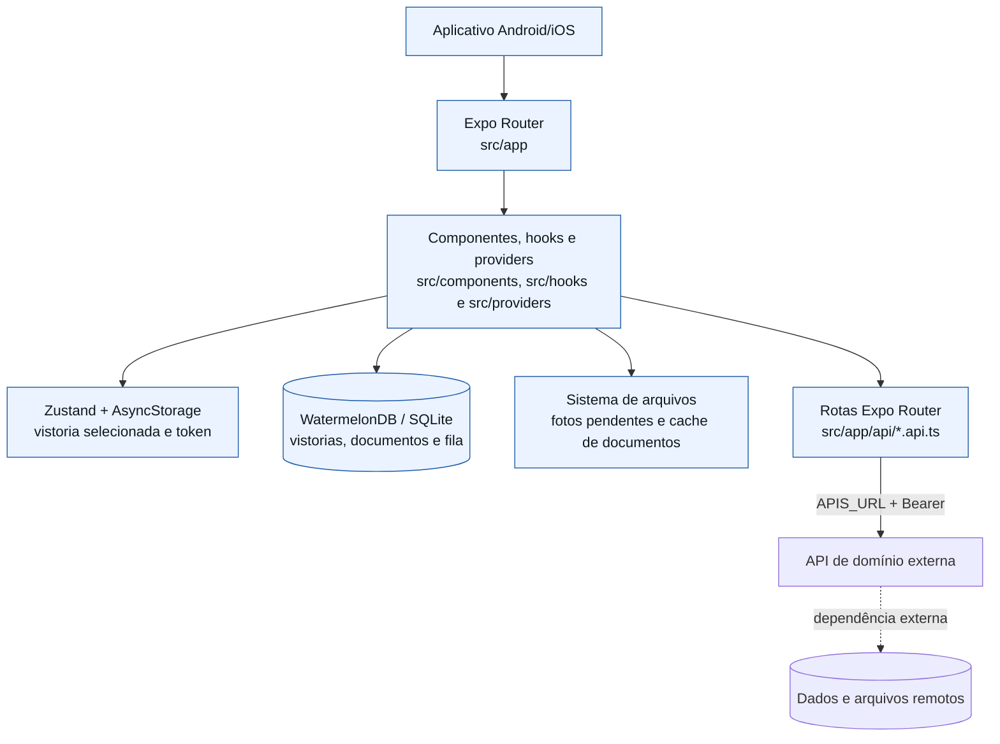
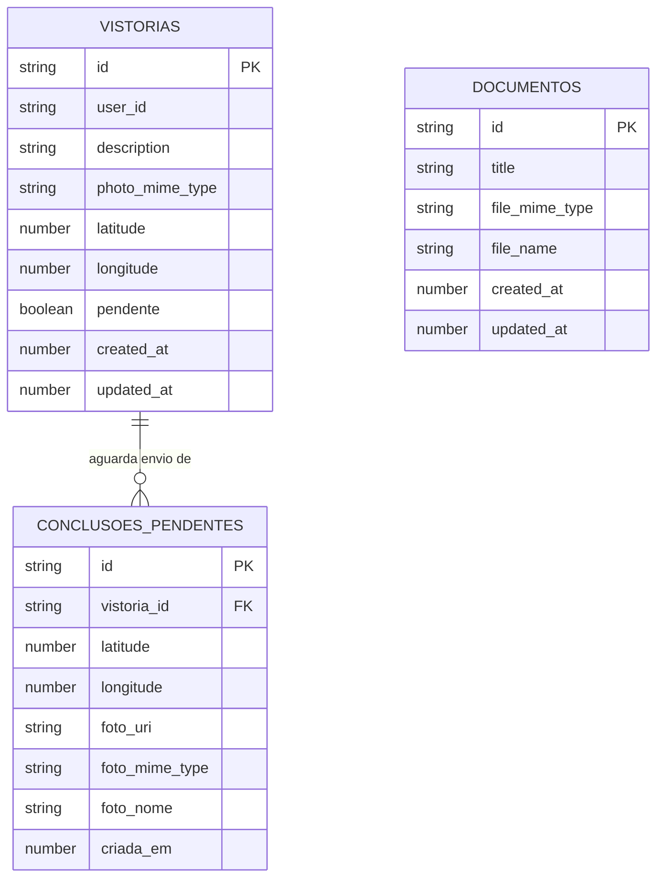
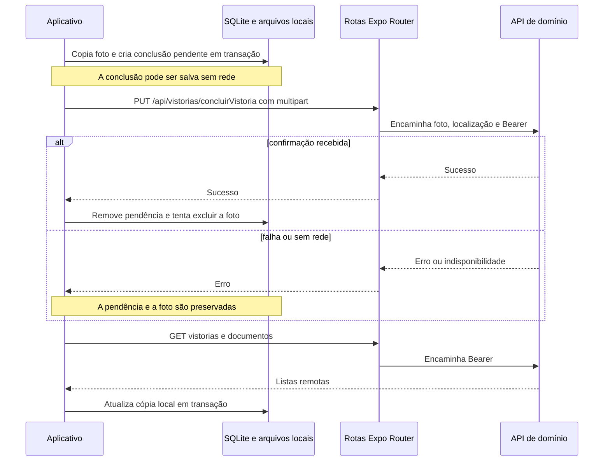
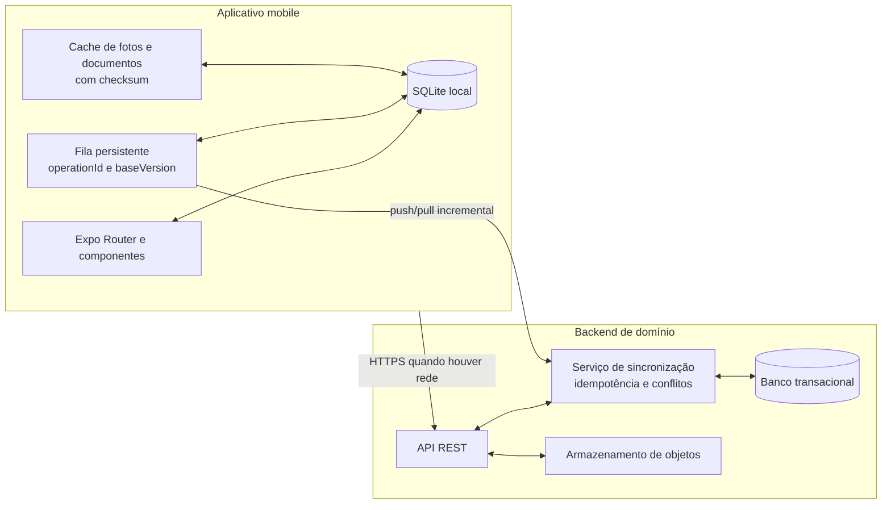

# Arquitetura da aplicação mobile

## Princípios que orientam o desenho

1. **A conclusão da vistoria deve sobreviver à perda de conexão.** Foto, localização e referência da vistoria são persistidas no aparelho antes de aguardar a próxima sincronização.
2. **O banco local é a fonte de leitura do aplicativo.** As telas de vistorias e documentos observam o WatermelonDB; a API atualiza essa cópia, em vez de ser consultada diretamente por cada tela.
3. **A API de domínio continua sendo a fonte compartilhada de verdade.** O aplicativo mantém uma cópia de trabalho local e a API externa consolida os dados que serão vistos por outros clientes.
4. **Arquivos e metadados têm tratamentos distintos.** Metadados de vistorias e documentos são sincronizados em listas; fotos pendentes são persistidas no sistema de arquivos até o envio ser confirmado.
5. **A autorização é decidida no servidor.** O aplicativo armazena e encaminha o token de acesso; as rotas do Expo e a API de domínio devem validar a operação solicitada.

## Arquitetura atual



### Camadas e responsabilidades atuais

| Camada | Local | Responsabilidade | Limite atual |
| --- | --- | --- | --- |
| Rotas e apresentação | `src/app/` e `src/components/` | Renderiza login, navegação, vistorias, documentos, mapa, captura de foto e feedback. | O acesso às rotas da área autenticada não é protegido antes da renderização. |
| Estado de interface | `src/stores/` e `AsyncStorage` | Mantém a vistoria ativa e o token de acesso entre aberturas do app. | O token é armazenado em `AsyncStorage`, não no armazenamento seguro do sistema operacional. |
| Conectividade e sincronização | `src/providers/`, `src/services/` e `src/hooks/` | Detecta rede, envia pendências e atualiza o banco local. | Não há retentativa com política de espera, telemetria de fila nem resolução explícita de conflitos. |
| Persistência local | `src/db/` | Define o esquema WatermelonDB, migrações, modelos e operações atômicas locais. | O esquema não registra versão remota, cursor de sincronização ou estado detalhado por operação. |
| Arquivos locais | `expo-file-system` | Copia fotos pendentes para `Paths.document` e cria arquivos temporários para abrir documentos. | Documentos não são catalogados nem validados para uso offline; o cache é transitório. |
| BFF leve | `src/app/api/` | Encaminha autenticação, vistorias, documentos e conclusão à API definida em `APIS_URL`. | Depende de servidor Expo implantado para funcionar em builds nativos de produção. |
| Domínio e persistência remota | Fora do repositório | Autenticação, regras de negócio, autorização, dados e armazenamento remoto. | O contrato é uma dependência de integração, não código auditável neste projeto. |

### Organização do código

```text
src/
├── app/
│   ├── (aplicacao)/            # Rotas autenticadas: home, vistorias e documentos
│   ├── api/                    # Adaptadores HTTP para a API de domínio externa
│   ├── _layout.tsx             # Provedor visual e stack raiz
│   └── index.tsx               # Tela de login
├── components/
│   ├── Buttons/                # Ações de interface reutilizáveis
│   ├── Home/                   # Mapa e elementos da tela principal
│   ├── ItensVazios/            # Estados vazios de listas
│   ├── Login/                  # Formulário e campo de autenticação
│   ├── Modals/                 # Confirmações e feedbacks
│   ├── Navegacao/              # Barra inferior da área autenticada
│   └── ui/                     # Primitivas locais do Gluestack UI
├── db/
│   ├── models/                 # Modelos WatermelonDB
│   ├── schema.ts               # Tabelas locais e colunas
│   ├── migrations.ts           # Evolução do esquema SQLite
│   └── sincronizacao.ts        # Operações locais e fila de conclusões
├── hooks/                      # Localização e horário global
├── providers/                  # Contexto de conexão e sincronização automática
├── services/                   # Multipart e integração offline-first
└── stores/                     # Estado persistido da vistoria selecionada
```

## Fluxos presentes

- **Autenticação:** `FormularioLogin` chama `/api/auth/login`. O token devolvido pela API de domínio é armazenado como `accessToken` no `AsyncStorage`; na próxima abertura, sua presença direciona o usuário para `/home`.
- **Atualização local:** ao entrar em estado online, `ProvedorConexao` executa `sincronizarDadosComApi`. A rotina busca vistorias e documentos, e atualiza as tabelas locais em transações WatermelonDB.
- **Seleção e conclusão de vistoria:** a tela de vistorias observa registros pendentes no banco, e a seleção é mantida com Zustand. A tela inicial captura uma foto e obtém a localização atual antes de concluir a vistoria.
- **Conclusão online:** a foto, as coordenadas e o identificador são enviados como `multipart/form-data` para a rota Expo; após confirmação, o registro local é atualizado como concluído.
- **Conclusão offline:** a foto é copiada para `Paths.document/vistorias-pendentes`, um registro é criado em `conclusoes_pendentes` e a vistoria local é atualizada. Quando a rede retorna, as pendências são enviadas em ordem de criação e removidas somente após a confirmação da API.
- **Documentos:** a sincronização traz metadados para a tabela `documentos`. Ao abrir um item, o arquivo é obtido pela rota autenticada, salvo no cache e entregue ao visualizador nativo ou ao compartilhamento do sistema.

## Modelo de dados local



O vínculo entre `conclusoes_pendentes.vistoria_id` e a vistoria é lógico; o WatermelonDB não declara uma relação de chave estrangeira no esquema atual. A foto pendente permanece fora do banco, no caminho armazenado em `foto_uri`.

## Sincronização offline atual

### Fluxo implementado



### Garantias e limites

| Aspecto | Estado atual |
| --- | --- |
| Persistência antes do envio | Implementada para conclusões offline, com foto em diretório de documentos e registro na fila. |
| Evitar execuções concorrentes | Implementada no `ProvedorConexao` com uma referência em memória. |
| Ordenação | As conclusões pendentes são processadas por `criada_em`, em ordem crescente. |
| Reenvio após falha | A pendência é preservada quando a chamada falha antes da confirmação. |
| Idempotência | Depende da API externa; a fila atual não envia `operationId` nem possui confirmação persistida por operação. |
| Conflitos | Não há versionamento local/remoto nem interface de resolução de conflito. |
| Download offline de documentos | Não está implementado como recurso persistente; o arquivo é baixado quando o usuário tenta abri-lo. |

## Arquitetura de referência para a evolução

Para completar o fluxo offline-first, a API de domínio deve oferecer operações idempotentes e leitura incremental de mudanças. O aplicativo mantém o WatermelonDB como fonte de leitura, mas registra a versão conhecida, a fila de operações e o cursor de sincronização.



### Contrato de sincronização recomendado

| Endpoint | Finalidade | Regras essenciais |
| --- | --- | --- |
| `POST /sync/push` | Recebe operações locais pendentes. | Autenticado, idempotente por `operationId`, com resultado por operação e `baseVersion`. |
| `GET /sync/pull?cursor=<sequência>` | Devolve alterações posteriores ao cursor confirmado. | Paginação, ordem estável, versões e marcações de exclusão. |

Fotos e documentos devem continuar em endpoints de arquivo dedicados. A API deve armazenar checksum, tipo MIME, tamanho e vínculo com a vistoria ou documento; o aplicativo só remove um arquivo local após a confirmação explícita de persistência remota.

## Segurança, privacidade e operação

- Mover o token de `AsyncStorage` para armazenamento seguro do sistema, como `expo-secure-store`, e prever expiração e renovação controladas.
- Implantar o servidor das API Routes do Expo e configurar a origem do `expo-router` para os builds nativos; sem isso, os `fetch` relativos não têm uma origem de produção garantida.
- Validar autorização, tipo MIME, tamanho e conteúdo dos arquivos na API de domínio. A validação no aplicativo não é barreira de segurança.
- Tratar fotos e localização como dados pessoais: aplicar acesso mínimo, retenção definida, auditoria e exclusão conforme a política aplicável.
- Registrar métricas de conectividade, tamanho e idade da fila, falhas de upload, tentativas e tempo de sincronização.
- Não registrar tokens, coordenadas precisas ou conteúdo de arquivos em logs de produção.

## Qualidade e critérios de aceite recomendados

| Área | Verificação relevante |
| --- | --- |
| Offline | Concluir uma vistoria sem rede, fechar o app e confirmar que foto e fila permanecem disponíveis após reabrir. |
| Retomada | Interromper a rede durante o envio e validar que a pendência continua até uma confirmação bem-sucedida. |
| Sincronização | Restaurar a rede e validar a remoção da fila, da foto pendente e a atualização de vistorias e documentos locais. |
| Documentos | Abrir PDF e DOCX autenticados em Android e iOS, incluindo ausência de aplicativo visualizador. |
| Localização e câmera | Negar permissões e verificar orientações claras; conceder permissões e confirmar latitude, longitude e foto enviados. |
| Segurança | Usar token ausente ou inválido e garantir que a API não exponha dados ou arquivos protegidos. |

## Melhorias priorizadas

1. Implantar e configurar o servidor das API Routes para produção nativa, com origem segura do Expo Router.
2. Armazenar credenciais em armazenamento seguro e proteger as rotas autenticadas antes da renderização.
3. Acrescentar `operationId`, versão remota e cursor de sincronização ao banco local e ao contrato da API.
4. Implementar retentativas com espera progressiva, estados persistentes de erro e tratamento de conflitos.
5. Persistir versões e checksums de documentos para disponibilizá-los offline com invalidação segura.
6. Cobrir captura, fila, sincronização e abertura de documentos com testes automatizados e cenários reais de interrupção de rede.
