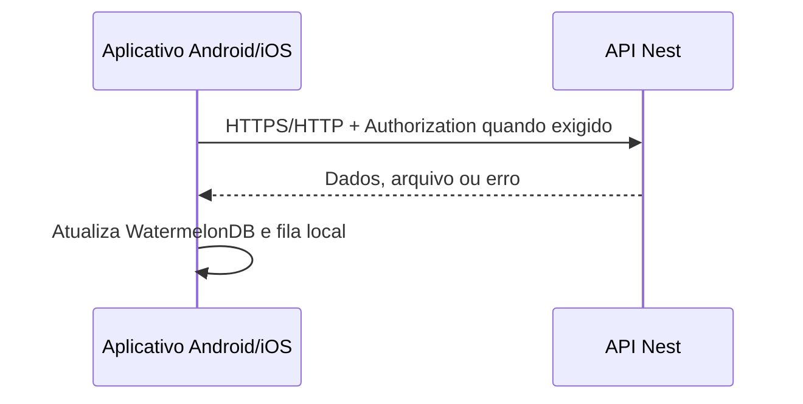

# Requisições de API do aplicativo mobile

## Papel da integração

O aplicativo Expo/React Native chama a API Nest diretamente. Não há API Routes
do Expo, Backend for Frontend (BFF) nem servidor web do Expo neste projeto.



As telas continuam lendo vistorias e documentos do WatermelonDB/SQLite. As
respostas remotas atualizam essa cópia local; a interface não depende de uma
requisição para renderizar dados já sincronizados.

## Configuração da origem

Crie `vistoria-mobile/.env.local` a partir de `.env.example`:

```dotenv
EXPO_PUBLIC_API_URL=http://10.0.2.2:3001
```

`EXPO_PUBLIC_API_URL` é incorporada ao bundle do aplicativo. Ela deve conter
somente a origem pública da API, sem barra final e sem senhas, tokens ou outros
segredos.

| Ambiente | Valor esperado |
| --- | --- |
| Emulador Android | `http://10.0.2.2:3001` |
| Dispositivo físico na mesma rede | `http://IP_LAN_DO_COMPUTADOR:3001` |
| Produção | `https://api.exemplo.com` |

`localhost` no Android aponta para o próprio emulador ou aparelho, não para o
computador que executa Docker. O nome `api` também não deve ser usado: ele só
existe na rede interna do Compose.

## Autenticação e chamadas protegidas

O login chama diretamente `POST /usuarios/login` e transforma o campo de tela
`senha` no campo de contrato `password`:

```ts
const apiUrl = process.env.EXPO_PUBLIC_API_URL + "/usuarios/login"

const response = await fetch(apiUrl, {
  method: "POST",
  headers: { "Content-Type": "application/json" },
  body: JSON.stringify({ email, password: senha }),
})
```

A resposta de sucesso contém `accessToken`, que é persistido como
`accessToken` no `AsyncStorage`. As chamadas protegidas enviam:

```http
Authorization: Bearer <accessToken>
```

## Rotas usadas pelo aplicativo

| Rota da API Nest | Método | Uso no aplicativo | Autorização |
| --- | --- | --- | --- |
| `/usuarios/login` | `POST` | Autentica o técnico com `email` e `password`. | Pública |
| `/vistorias` | `GET` | Atualiza a tabela local de vistorias. | Bearer |
| `/vistorias/:id` | `PUT` | Conclui uma vistoria com foto e localização. | Bearer |
| `/documentos` | `GET` | Atualiza a tabela local de documentos. | Bearer |
| `/documentos/:id/arquivo` | `GET` | Baixa o arquivo autenticado para o cache do dispositivo. | Bearer |

### Atualização ao acessar telas

`useFocusEffect` é usado nas telas. Quando uma tela recebe foco e o
`ProvedorConexao` informa `estaOnline`, o aplicativo executa somente a chamada
correspondente:

- **Vistorias:** `GET /vistorias` e atualização da tabela `vistorias`;
- **Documentos:** `GET /documentos` e atualização da tabela `documentos`.

O estado de conexão vem de `expo-network`: considera-se online quando
`isConnected` é `true` e `isInternetReachable` não é `false`. Sem conexão, as
telas mantêm os dados locais e não fazem GET. Quando a rede é recuperada, o
`ProvedorConexao` também executa a sincronização geral, incluindo a fila de
conclusões pendentes.

### Conclusão de vistoria

A conclusão usa `PUT /vistorias/:id` com `multipart/form-data`. O aplicativo
constrói o corpo binário para enviar:

- `photo`: foto capturada;
- `pendente`: `false`;
- `completedAt`: data ISO-8601 capturada no momento da confirmação;
- `latitude` e `longitude`: coordenadas obtidas pelo dispositivo.

Se a API retornar `409 INSPECTION_COMPLETION_CONFLICT`, a resposta traz a
vistoria vencedora. O aplicativo remove a pendência perdedora, atualiza o banco
local e informa o conflito. Sem rede, foto e metadados permanecem na fila local
até a próxima sincronização.

### Documentos

Os metadados vêm de `GET /documentos`. Quando a pessoa usuária abre um item, o
aplicativo chama `GET /documentos/:id/arquivo` com Bearer, grava a resposta no
cache e entrega o arquivo ao visualizador ou compartilhamento nativo.

## Limites de segurança

- `EXPO_PUBLIC_API_URL` é pública por definição; não armazene segredos nela.
- O token precisa continuar sendo validado pela API Nest em todas as rotas
  protegidas.
- Em produção, a API deve usar HTTPS e estar acessível pelo dispositivo.
- O `AsyncStorage` atende ao fluxo atual, mas não substitui o armazenamento
  seguro do sistema operacional para tokens de produção.
