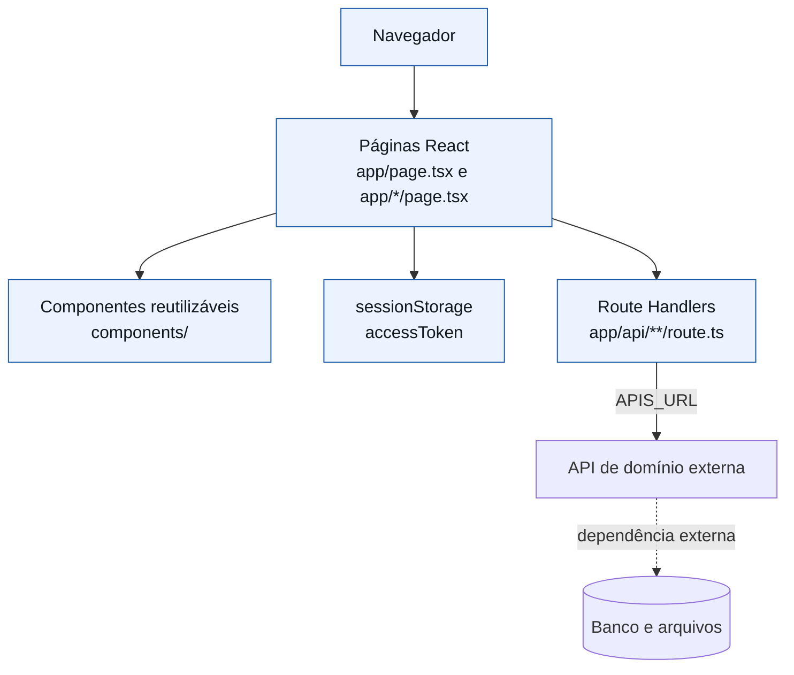
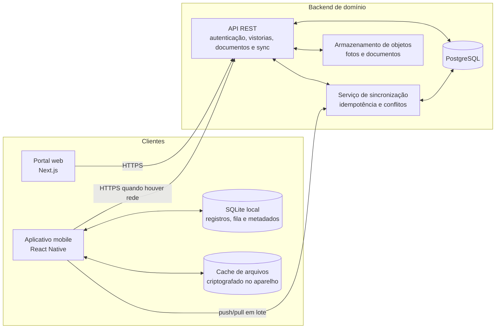
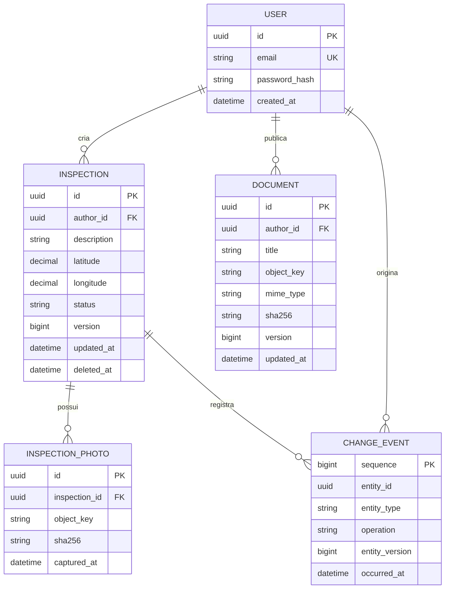

# Arquitetura da aplicação

## Princípios que orientam o desenho

1. **A captura não pode depender da rede.** Foto, localização e dados da vistoria são confirmados no aparelho antes de qualquer tentativa de envio.
2. **O servidor é a fonte de verdade compartilhada.** Cada cliente possui uma cópia de trabalho; somente o servidor consolida o estado que será visto por todos.
3. **Sincronizar deve poder ser repetido com segurança.** Uma queda depois do envio não pode criar vistorias ou anexos duplicados.
4. **Conflito é informação de negócio, não erro silencioso.** Quando duas edições não puderem ser combinadas, o usuário deve saber qual versão prevaleceu e ter histórico para auditoria.
5. **Dados e arquivos têm ciclos diferentes.** Metadados pequenos sincronizam em lote; fotos e documentos usam transferência resiliente, checksum e retentativa independente.
6. **Autorização é verificada no servidor.** O cliente informa identidade e intenção; a API decide se aquela operação é permitida.

## Arquitetura atual



### Camadas e responsabilidades atuais

| Camada | Local | Responsabilidade | Limite atual |
| --- | --- | --- | --- |
| Apresentação | `app/` e `components/` | Renderiza formulários, tabelas, filtros, feedback e navegação. | O estado é local por tela; não há cache de dados compartilhado. |
| Integração no navegador | Funções `fetch` dentro das páginas | Envia token e dados à rota interna correspondente. | Chamadas e tipos de domínio se repetem entre páginas. |
| Backend for Frontend (BFF) leve | `app/api/` | Encaminha chamadas à API configurada, repassa autorização e faz pequenas transformações. | Não contém regra de negócio persistente, cache nem validação robusta de token. |
| Domínio e persistência | Fora do repositório, acessados por `APIS_URL` | Autenticação, dados de vistorias, documentos e armazenamento. | O contrato é uma dependência de integração, não código auditável neste projeto. |

### Organização do código

```text
app/
├── api/                    # Adaptadores HTTP entre o portal e a API externa
│   ├── auth/               # Login e cadastro de usuário
│   ├── documentos/         # Metadados, upload, alteração, remoção e arquivo
│   └── vistorias/          # Consulta e criação de vistorias
├── dashboard/              # Visão operacional resumida
├── documentos/             # Consulta e envio de documentos
├── vistorias/              # Consulta, filtros e criação de vistorias
├── cadastro/               # Cadastro de técnico
└── page.tsx                # Login

components/
├── Buttons/                # Ações de navegação reutilizáveis
├── Dashboard/              # Card de indicadores
├── Modals/                 # Feedback de erro e sucesso
├── Tables/                 # Representação tabular de dados remotos
└── PagesCommomSidebar.tsx  # Navegação da área autenticada

utils/
└── Sair.ts                 # Encerramento da sessão no navegador
```

### Fluxos web presentes

- **Autenticação:** o login chama `/api/auth/login`; a resposta da API de domínio deve conter `accessToken`. A página guarda esse valor em `sessionStorage` e redireciona para o dashboard.
- **Vistorias:** as listagens buscam `/api/vistorias` com `Authorization: Bearer <token>`. O cadastro cria uma vistoria com `description`; o Backend for Frontend (BFF) extrai `sub` do token e o envia como `userId` para a API externa.
- **Documentos:** o cliente usa `FormData` para enviar título e arquivo a `/api/documentos`. A interface aceita PDF e DOCX de até 10 MB. A visualização solicita o fluxo de bytes de `/api/documentos/:id/arquivo` e cria uma URL temporária no navegador.
- **Cadastro de técnico:** envia e-mail e senha a `/api/auth/cadastrarUsuario`; o Backend for Frontend (BFF) repassa o corpo à API externa.

Os detalhes de cada rota estão em [REQUISICOES_API.md](REQUISICOES_API.md).

## Arquitetura de referência para o desafio completo

Uma solução completa preserva o portal Next.js como cliente web, mas coloca as regras de negócio em uma API independente e acrescenta um aplicativo móvel com persistência local. Next.js não deve ser a única camada que resolve sincronização: ela exige transações, controle de versão, idempotência e jobs que sobrevivam à reinicialização da interface.



### Responsabilidades propostas

| Componente | Responsabilidade |
| --- | --- |
| Portal web | Administração, consulta, upload de documentos e visualização das vistorias sincronizadas. Não mantém uma cópia offline das vistorias. |
| Aplicativo mobile | Login, captura de foto e localização, leitura de registros locais, fila de mudanças e download de documentos para consulta offline. |
| SQLite local | Fonte de leitura do aplicativo. Guarda entidade, versão remota conhecida, estado da fila, operações pendentes e metadados de download. |
| API de domínio | Regras de autorização, validação, geração de IDs, acesso ao PostgreSQL, emissão de URLs de upload/download e exposição de contratos estáveis aos dois clientes. |
| Serviço de sincronização | Processa operações idempotentes, detecta conflito por versão, registra auditoria e entrega alterações remotas desde um cursor. |
| PostgreSQL | Fonte de verdade para entidades, relações, versões, auditoria e cursor de alterações. |
| Armazenamento de objetos | Conteúdo binário de fotos e documentos; o banco guarda apenas metadados, checksum, chave e vínculo com a entidade. |

## Modelo de dados de referência



Alguns detalhes evitam problemas frequentes em sincronização:

- Identificadores UUID são gerados no cliente para novas entidades. Assim, uma vistoria criada sem conexão já pode referenciar suas fotos e não precisa trocar de ID após o envio.
- `version` é incrementada pela transação que altera a entidade no servidor. `updated_at` ajuda na auditoria, mas não é a única base para decidir conflitos porque relógios de aparelhos não são confiáveis.
- Exclusões usam marcação lógica (`deleted_at`) até que todos os clientes tenham oportunidade de receber a mudança. Isso impede que um registro apagado reapareça por causa de uma fila antiga.
- Fotos e documentos carregam `sha256`; o checksum permite detectar reenvio, corrupção e retomada segura de upload.
- `CHANGE_EVENT.sequence` fornece um cursor monotônico para o cliente buscar somente o que mudou desde a última sincronização confirmada.

## Sincronização offline e conflitos

### Estratégia escolhida

A estratégia recomendada é **versionamento otimista por entidade, operações idempotentes e resolução campo a campo para campos independentes**. Quando a mesclagem automática não for segura, a API mantém a versão do servidor e devolve um conflito explícito para revisão do usuário. Não se deve adotar apenas “last write wins por timestamp”: a hora do aparelho pode estar errada e uma atualização tardia pode apagar uma alteração relevante sem deixar rastreabilidade.

Cada mudança na fila móvel contém:

```json
{
  "operationId": "uuid-imutavel",
  "entityId": "uuid-da-vistoria",
  "type": "inspection.update",
  "baseVersion": 7,
  "payload": {
    "description": "Instalação concluída",
    "status": "CONCLUIDA"
  },
  "occurredAt": "2026-09-02T14:30:00.000Z"
}
```

- `operationId` é persistido antes de a requisição sair do aparelho. O servidor registra a operação já processada e devolve o mesmo resultado se ela chegar novamente.
- `baseVersion` é a versão remota conhecida no instante da edição. Se ela coincide com a versão no banco, a mudança pode ser aplicada de forma atômica e a versão aumenta.
- O servidor usa sua própria hora para `updated_at`. `occurredAt` é mantido como contexto e auditoria, não como árbitro principal.
- Mudanças em campos independentes podem ser mescladas quando suas versões por campo ou a trilha de alterações comprovarem que não houve sobreposição. Exemplos: uma foto adicionada não conflita com a alteração da descrição; coordenadas capturadas não devem sobrescrever uma descrição editada no web.
- Duas alterações no mesmo campo a partir da mesma `baseVersion` constituem conflito. O servidor não apaga a alteração existente: devolve o estado atual, as diferenças e uma chave de conflito para a interface apresentar a decisão.

### Fluxo de sincronização

```mermaid
sequenceDiagram
    participant App as Aplicativo mobile
    participant Local as SQLite local
    participant API as API de sincronização
    participant DB as PostgreSQL

    App->>Local: Salva vistoria, foto e operação pendente em transação
    Note over App,Local: A captura é confirmada mesmo offline
    App->>API: POST /sync/push (lote ordenado por dependência)
    API->>DB: Consulta operationId e baseVersion
    alt operação já processada
        DB-->>API: Resultado previamente registrado
        API-->>App: Resultado idempotente
    else versão compatível
        API->>DB: Aplica mudança, incrementa version e registra evento
        API-->>App: Sucesso com versão e cursor
    else conflito
        DB-->>API: Estado atual e campos concorrentes
        API-->>App: Conflito explícito, sem descartar o rascunho local
    end
    App->>Local: Marca sucesso ou conflito; preserva evidências
    App->>API: GET /sync/pull?cursor=...
    API->>DB: Busca eventos posteriores ao cursor
    API-->>App: Alterações remotas e novo cursor
    App->>Local: Atualiza cópia local em transação
```

### Ordem e tratamento de arquivos

1. A vistoria e os metadados da foto são gravados localmente no mesmo momento em que o usuário conclui a captura.
2. Ao voltar a rede, o cliente envia primeiro o registro da vistoria. O UUID local permite manter o vínculo sem uma etapa de remapeamento.
3. A API entrega uma URL pré-assinada ou um endpoint autenticado para o upload do binário. O aplicativo envia o arquivo em partes quando o provedor suportar retomada.
4. Depois do upload, o cliente confirma o checksum e a API marca a foto como disponível. Uma falha mantém a operação pendente sem duplicar o binário.
5. Documentos publicados no web são listados por versão. O mobile baixa apenas a versão ausente, grava o checksum e mantém o arquivo no cache local. Uma versão nova invalida a anterior somente depois que o download novo for validado.

### Estados que a interface deve comunicar

| Estado | Significado para a pessoa usuária |
| --- | --- |
| Salvo neste aparelho | Registro confirmado localmente, ainda sem confirmação do servidor. |
| Sincronizando | Operação na fila com envio em curso. |
| Sincronizado | Servidor confirmou a versão exibida. |
| Requer atenção | Há conflito ou falha não recuperável automaticamente; o rascunho foi preservado. |
| Documento disponível offline | Arquivo validado e acessível sem rede. |
| Atualização disponível | Existe versão mais recente do documento ou da vistoria no servidor. |

## Contrato de sincronização recomendado

O contrato não precisa reproduzir todos os recursos REST na sincronização. Dois endpoints bastam para o tráfego de dados estruturados:

| Endpoint | Finalidade | Regras essenciais |
| --- | --- | --- |
| `POST /sync/push` | Recebe um lote de operações locais pendentes. | Autenticado, idempotente por `operationId`, transacional por operação e com resultado individual para sucesso, duplicidade ou conflito. |
| `GET /sync/pull?cursor=<sequência>` | Devolve mudanças posteriores ao cursor confirmado. | Paginação, cursor monotônico, tombstones de exclusão e ordem estável. |

Fotos e documentos usam endpoints de arquivo separados. O payload do `push` deve transportar referências e metadados, nunca o binário inteiro de vários anexos em JSON.

## Segurança, privacidade e operação

- Armazene senhas somente com hash adaptativo, como Argon2id ou bcrypt, e nunca retorne hash ou token em logs.
- Use access token curto e refresh token protegido. No portal, a sessão deve ser mantida em cookie `HttpOnly`; no mobile, em armazenamento seguro do sistema operacional.
- A autorização deve ser aplicada por recurso: um usuário pode consultar ou alterar somente vistorias e documentos da sua organização e papel.
- Exija HTTPS, valide MIME type e assinatura do arquivo no servidor, imponha limite de tamanho e faça varredura antimalware antes de disponibilizar anexos a terceiros.
- Dados de localização e fotos podem ser dados pessoais. Defina retenção, acesso mínimo, trilha de auditoria e exclusão conforme a política aplicável.
- Registre métricas de fila, idade da operação mais antiga, conflitos, falhas de upload, latência e taxa de sincronização. Esses indicadores são mais úteis do que inferir conectividade pela interface.
- Faça backup do PostgreSQL, versionamento de migrações e política de ciclo de vida para o armazenamento de objetos.

## Qualidade e critérios de aceite recomendados

| Área | Verificação relevante |
| --- | --- |
| Offline | Abrir o app sem rede, consultar registros já baixados, criar vistoria com foto e coordenada e reiniciar o app sem perder a fila. |
| Sincronização | Cortar a rede durante o envio, retomar e confirmar que há uma única entidade e um único anexo no servidor. |
| Conflitos | Editar o mesmo campo no web e no mobile a partir da mesma versão; confirmar que nada é apagado silenciosamente e que o usuário consegue decidir. |
| Documentos | Baixar um arquivo, abrir sem rede, publicar uma nova versão no web e validar substituição segura após checksum. |
| Autorização | Tentar acessar recurso de outra organização, alterar token e repetir download sem credencial válida. |
| Regressão web | Exercitar login, cadastro de técnico, listagem/criação de vistoria, upload e visualização de PDF/DOCX. |

## Melhorias priorizadas

1. Implementar a API de domínio versionada, suas migrações PostgreSQL e contratos de autenticação, recursos e sincronização.
2. Criar o aplicativo mobile com SQLite, fila persistente, captura de câmera/localização e cache de documentos.
3. Substituir o token em `sessionStorage` por sessão segura no portal e proteger as rotas antes da renderização.
4. Exibir coordenadas e foto no dashboard web, com mapa opcional em Leaflet/OpenStreetMap e alternativa textual acessível.
5. Adicionar testes de unidade para regras de conflito, testes de integração para idempotência e testes de ponta a ponta para os fluxos críticos.
6. Versionar Docker, Compose e pipeline de CI para build, lint, testes, migrações e análise de dependências.
