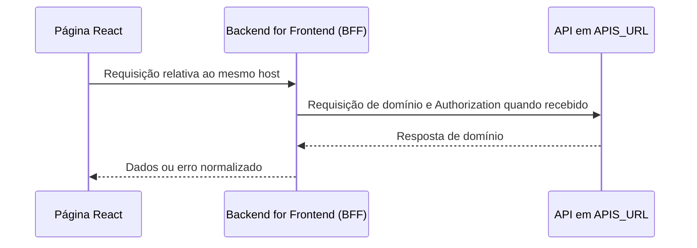

# Rotas de integração

## Papel das rotas internas

As rotas em `app/api` são uma camada de integração do portal web. Elas não são a API de domínio definitiva: recebem a chamada do navegador, montam a chamada equivalente para `APIS_URL` e devolvem a resposta da API externa. Não há persistência, cache ou regra de negócio durável nesses handlers.



## Configuração

```dotenv
APIS_URL=http://localhost:3001
```

`APIS_URL` é obrigatório em todos os ambientes. A implementação concatena os caminhos, por isso a URL base não deve terminar em `/`.

## Mapa de rotas

| Portal web | Método | Destino em `APIS_URL` | Corpo recebido pelo portal | Autorização |
| --- | --- | --- | --- | --- |
| `/api/auth/login` | `POST` | `/usuarios/login` | `{ "email", "senha" }` | Não encaminhada. |
| `/api/auth/cadastrarUsuario` | `POST` | `/usuarios` | `{ "email", "password" }` | Não encaminhada. |
| `/api/vistorias` | `GET` | `/vistorias` | Sem corpo | Encaminha `Authorization` se presente. |
| `/api/vistorias` | `POST` | `/vistorias` | `{ "description" }` | `Bearer` obrigatório no Backend for Frontend (BFF). |
| `/api/vistorias/:id` | `DELETE` | `/vistorias/:id` | Sem corpo | Encaminha `Authorization` se presente. |
| `/api/vistorias/:id/foto` | `GET` | `/vistorias/:id/foto` | Sem corpo | Encaminha `Authorization` se presente. |
| `/api/documentos` | `GET` | `/documentos` | Sem corpo | Encaminha `Authorization` se presente. |
| `/api/documentos` | `POST` | `/documentos` | `multipart/form-data` com `title` e `file` | Encaminha `Authorization` se presente. |
| `/api/documentos/:id` | `PUT` | `/documentos` | `multipart/form-data`; o Backend for Frontend (BFF) inclui `id` no formulário | Encaminha `Authorization` se presente. |
| `/api/documentos/:id` | `DELETE` | `/documentos/:id` | Sem corpo | Encaminha `Authorization` se presente. |
| `/api/documentos/:id/arquivo` | `GET` | `/documentos/:id/arquivo` | Sem corpo | Encaminha `Authorization` se presente. |

## Transformações e contratos observados

### Autenticação

- **Login:** a página envia `senha`, mas o Route Handler transforma o campo para `password` antes de chamar a API externa. A resposta é consumida pela interface como `{ accessToken: string }`.
- **Cadastro:** o navegador já envia `{ email, password }`; o handler apenas encaminha o objeto.
- **Sessão no portal:** após login, `accessToken` é salvo em `sessionStorage` e é enviado como `Authorization: Bearer <token>` pelas telas autenticadas.

### Vistorias

A interface trata uma vistoria retornada pela API externa com o seguinte formato:

```ts
interface Vistoria {
  id: string
  userId: string
  description: string
  photoMimeType: string | null
  latitude: number | null
  longitude: number | null
  pendente: boolean
  completedAt: string | null
  createdAt: string
  updatedAt: string
}
```

Para uma conclusão, a API retorna `completedAt`. A tela de detalhes usa esse
campo como **Finalizado em**; `updatedAt` não determina a precedência da
conclusão.

`PUT /vistorias/:id` exige `completedAt` ISO-8601 junto a `pendente: false`.
Uma vistoria concluída é terminal. Se a marcação recebida tiver horário igual
ou posterior ao já persistido, a API responde `409` com o código
`INSPECTION_COMPLETION_CONFLICT` e a vistoria vencedora.

As listagens devolvem o tipo MIME da foto, mas não o binário. A foto de uma
vistoria concluída é obtida de forma autenticada em
`GET /api/vistorias/:id/foto`; a resposta preserva o fluxo de bytes e os
cabeçalhos enviados pela API de domínio. A exclusão é encaminhada pelo
`DELETE /api/vistorias/:id`.

Na criação, o Route Handler exige `Bearer`, decodifica o payload do JWT e encaminha:

```json
{
  "description": "Instalação de equipamento",
  "userId": "valor-do-sub-do-token"
}
```

O handler apenas decodifica o payload para montar o corpo; ele não valida assinatura, emissor ou expiração. A API de domínio deve validar o token e inferir a identidade de forma confiável em vez de confiar somente no `userId` do corpo.

### Documentos

A interface espera metadados neste formato:

```ts
interface Documento {
  id: string
  title: string
  fileName: string
  fileMimeType:
    | 'application/pdf'
    | 'application/vnd.openxmlformats-officedocument.wordprocessingml.document'
  createdAt: string
}
```

O formulário web aceita os dois tipos acima e bloqueia arquivos maiores que 10 MB antes do envio. Essa checagem é uma conveniência para a pessoa usuária; a API externa deve repetir a validação de tamanho, tipo e conteúdo do arquivo.

O endpoint de arquivo preserva o corpo em streaming e os cabeçalhos que vierem da API externa. Para permitir que o navegador trate o arquivo corretamente, a API de domínio deve devolver ao menos `Content-Type` e, quando aplicável, `Content-Disposition`.

## Respostas de erro atuais

- Cada handler retorna `400` para dados obrigatórios ausentes nas validações já implementadas.
- A criação de vistoria retorna `401` quando o cabeçalho Bearer está ausente ou o payload não contém `sub` legível.
- Quando a API externa responde com erro, o handler preserva o status e devolve uma mensagem genérica em `{ "error": "..." }`.
- Exceções de parsing, rede ou configuração resultam em `500` com uma mensagem contextual.

A interface atualmente não interpreta um contrato de erro estruturado além de `response.ok`. Para a API de domínio, prefira um envelope estável que permita tratamento e observabilidade:

```json
{
  "error": {
    "code": "DOCUMENT_TOO_LARGE",
    "message": "O arquivo excede o limite permitido.",
    "requestId": "uuid"
  }
}
```

## Modelos de requisição

Os exemplos abaixo mostram chamadas do navegador para as rotas internas do portal. O Backend for Frontend (BFF) encaminha a operação para `APIS_URL`; portanto, a interface não chama a API de domínio diretamente.

### GET — listar vistorias

Use este formato para consultar os dados de uma coleção protegida. O token vem da sessão criada no login.

```ts
const token = sessionStorage.getItem('accessToken')

if (!token) {
  throw new Error('Sua sessão não foi encontrada.')
}

const response = await fetch('/api/vistorias', {
  method: 'GET',
  headers: {
    Authorization: `Bearer ${token}`,
  },
})

if (!response.ok) {
  throw new Error('Não foi possível recuperar as vistorias.')
}

const vistorias = await response.json()
```

### POST — criar vistoria

O portal envia somente a descrição em JSON. A rota interna exige `Bearer`, extrai o identificador do usuário do token e encaminha `userId` à API de domínio.

```ts
const token = sessionStorage.getItem('accessToken')

if (!token) {
  throw new Error('Sua sessão não foi encontrada.')
}

const response = await fetch('/api/vistorias', {
  method: 'POST',
  headers: {
    Authorization: `Bearer ${token}`,
    'Content-Type': 'application/json',
  },
  body: JSON.stringify({
    description: 'Instalação de equipamento no local informado.',
  }),
})

if (!response.ok) {
  throw new Error('Não foi possível cadastrar a vistoria.')
}

const vistoria = await response.json()
```

### PUT — atualizar documento

Atualizações de documento usam `multipart/form-data`. Não defina `Content-Type` manualmente: o navegador adiciona o limite multipart necessário ao enviar `FormData`.

```ts
const token = sessionStorage.getItem('accessToken')

if (!token) {
  throw new Error('Sua sessão não foi encontrada.')
}

const formData = new FormData()
formData.append('title', 'Manual de instalação revisado')

if (arquivoSelecionado) {
  formData.append('file', arquivoSelecionado)
}

const response = await fetch(`/api/documentos/${documentoId}`, {
  method: 'PUT',
  headers: {
    Authorization: `Bearer ${token}`,
  },
  body: formData,
})

if (!response.ok) {
  throw new Error('Não foi possível atualizar o documento.')
}

const documento = await response.json()
```

O arquivo continua sujeito aos tipos PDF e DOCX e ao limite de 10 MB aplicado no servidor. Para atualizar somente o título, envie apenas `title` no `FormData`.

## Convenções para evoluir a integração

- Valide entrada no Backend for Frontend (BFF) e na API de domínio. A validação no cliente melhora a experiência; a do servidor protege o sistema.
- Preserve `requestId` entre Backend for Frontend (BFF) e API para rastrear uma operação ponta a ponta.
- Mantenha a API de domínio versionada, por exemplo `/v1/vistorias`, antes de existir mais de um cliente em produção.
- Não encaminhe segredos de servidor ao navegador. Variáveis de ambiente usadas em handlers não devem ter o prefixo `NEXT_PUBLIC_`.
- Em endpoints que alteram dados, use autorização explícita no Backend for Frontend (BFF) e, obrigatoriamente, na API de domínio.
- Documente novos campos ao mesmo tempo que a tela que os consome; tipos duplicados no front devem ser migrados gradualmente para um contrato compartilhado ou geração de cliente.

O protocolo de sincronização necessário para o aplicativo mobile está em [ARQUITETURA.md](ARQUITETURA.md#sincronização-offline-e-conflitos). Ele não é implementado pelas rotas deste repositório.
